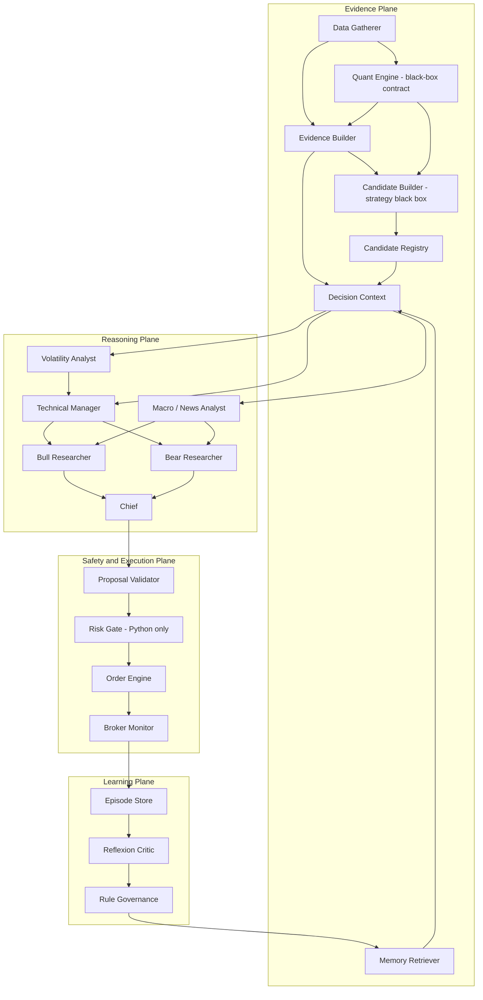
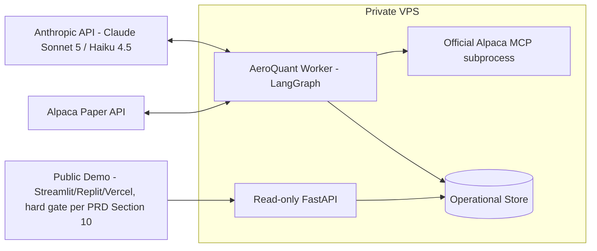
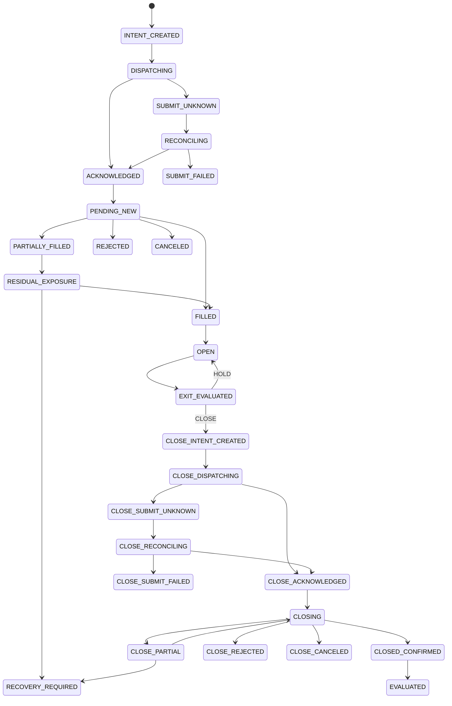

# AeroQuant Agent Architecture Discussion Pack

**Version:** v0.2 discussion draft (synced to PRD 2.4)  
**Date:** 28 August 2026 (kickoff day)  
**Audience:** AeroQuant engineering team  
**Status:** Architecture direction selected; detailed contracts and lifecycle remain open for team review. This draft does not authorize parallel implementation yet. **Provider and orchestration are no longer open questions** — v0.1 treated LLM provider as unconfirmed (BytePlus ModelArk, "exact endpoint and model IDs still need confirmation"); the PRD settled this in its own 2.2 revision (re-confirmed 2.3, unchanged 2.4): direct Anthropic API (Claude Sonnet 5 + Claude Haiku 4.5), orchestrated by LangGraph. This revision (v0.2) replaces every ModelArk reference below with that decision and reconciles the rest of this document against PRD 2.4. See §10 and the changelog at the end of this section.  
**Source:** `PRD_AeroQuant_2.4_VRP_Harvester.md` (supersedes the `2.1` snapshot this draft was originally reviewed against) and the working-tree snapshot reviewed on 27 August 2026. Code line references may move as the project changes.

> This document focuses on agents, models, orchestration, memory, execution flow, and deployment. Strategy research, calibration, formulas, and policy values are intentionally out of scope. Runtime candidate adjudication remains in scope, while candidate generation and exit policy are represented as replaceable black-box contracts.

**Changelog, v0.1 → v0.2:**
- LLM provider swapped throughout: BytePlus ModelArk → direct Anthropic API (Claude Sonnet 5 + Claude Haiku 4.5), per PRD §5.3.
- Orchestration confirmed as LangGraph (`StateGraph` + checkpointer), per PRD §5.3 — §10 now maps the existing plane/wave design onto concrete LangGraph nodes and edges instead of a generic `ModelGateway`.
- Added the PRD §9 paper-settlement-bug guardrail (force-close every short leg before natural expiry) as a first-class execution-plane requirement — it was missing from v0.1 entirely (§4, §14).
- Corrected the PRD version-numbering note in §4 (PRD is now internally versioned 2.4; the "2.0 vs 2.1" filename mismatch v0.1 flagged has been superseded by a bigger inconsistency — see §4).
- Removed "Open Decisions" rows that PRD 2.4 has since resolved (ModelArk endpoint choice, model routing policy); added new open items PRD 2.4 surfaces (Anthropic rate limits/prompt caching, VPS geographic placement, public-demo-host vs. private-VPS-API split).
- §12 now explicitly separates the private VPS worker from the mandatory public demo host (Streamlit/Replit/Vercel per PRD §10) and adds a VPS geographic-placement note.

---

## 1. Executive Summary

AeroQuant should not be integrated by adding more agents directly to the current monolithic pipeline. The current project already contains useful building blocks, especially the provider abstraction, structured agent skeleton, Alpaca SDK adapter, read-only MCP integration, deterministic risk helpers, SQLite evaluation store, and dashboard shell. However, the operational flow has critical state-management defects that would make agent evaluation and Reflexion unreliable.

The selected direction is a **modular vertical slice**:

- Preserve useful Alpaca, MCP, LLM, evaluation, and dashboard components behind explicit interfaces.
- Introduce typed and versioned contracts between every stage.
- Replace the monolithic cycle with a checkpointed workflow coordinator.
- Keep all Alpaca trading actions behind deterministic services; LLM agents never receive trading tools.
- Make broker-confirmed fills and closes authoritative before positions or outcomes are recorded.
- Add the AeroQuant Bull/Bear debate and governed Reflexion loop only after the execution lifecycle is trustworthy.
- Run a persistent VPS backend calling the Anthropic API directly (Claude Sonnet 5 for reasoning-heavy roles, Claude Haiku 4.5 for fast/classification roles), orchestrated as a checkpointed LangGraph `StateGraph` — this is a team-confirmed decision per PRD §5.3, not an open question (v0.1 of this document still treated the provider as unresolved BytePlus ModelArk; that is now stale).
- Treat the PRD §9 paper-settlement-bug guardrail (force-close every short leg before natural expiry) as a mandatory, always-on scheduled job in the execution plane — not a detail left to the black-box Exit Policy.
- Optimize for hackathon hard gates first while creating seams that remain sustainable after the competition.

The proposed system has four planes: Evidence, Reasoning, Safety and Execution, and Learning. The strategy and quant layer can later be changed without rewriting the other planes.

---

## 2. Confirmed Team Direction

| Topic | Current decision |
|---|---|
| Primary goal | Satisfy hackathon criteria first, but avoid a disposable architecture |
| Available time | Less than one week, with four team members and AI-agent assistance |
| Backend | Persistent VPS intended to run continuously |
| LLM provider | **Confirmed (PRD §5.3, since 2.2, unchanged 2.4):** direct Anthropic API — Claude Sonnet 5 (`strong_reasoning`/`critic` roles) + Claude Haiku 4.5 (`fast_analysis` roles) — standalone API key, no gateway. This replaces v0.1's unresolved BytePlus ModelArk line. |
| Orchestration | **Confirmed (PRD §5.3):** LangGraph, checkpointed `StateGraph`, model-agnostic `ChatAnthropic` integration. See §10. |
| UI | Deferred for later team discussion; **hosting platform is not deferred** — Streamlit, Replit, or Vercel is a mandatory hard gate for the public demo (PRD §10). See §12. |
| Scope owned by this workstream | Agents, model gateway, orchestration, persistence, order/fill state machine, reconciliation, and Reflexion |
| Strategy and quant | Explicitly deferred; represented as black-box contracts |
| Integration approach | Modular vertical slice, not an in-place patch or full framework rewrite |
| Visual direction | Modern Minimalist |

---

## 3. Scope

### In Scope

- Agent roles, boundaries, and input projections
- Anthropic API integration (via LangGraph nodes) and role-based model routing
- Workflow orchestration, checkpoints, retries, and degraded states
- Alpaca MCP boundary and tool governance
- Deterministic proposal validation and final risk gate
- Durable order, fill, position, and reconciliation lifecycle
- Working, episodic, and semantic memory
- Reflexion trigger, critique contract, and rule governance
- Account-scoped persistence and auditability
- VPS runtime topology and process isolation
- Token, latency, error, evidence, and order-transition observability
- A migration plan from the current implementation

### Out of Scope

- Research, calibration, and selection of the final strategy policy
- Quantitative formulas, thresholds, or signal calibration
- Strike-selection mathematics and position-sizing formulas
- Backtest methodology or expected trading performance
- Final UI framework and visual implementation
- Fine-grained per-role prompt tuning and prompt-caching rollout order (tracked as an implementation task in §21, not an architecture question — the provider/model choice itself is resolved, see §2/§10)

The architecture still needs contracts for `CandidateBuilder`, `TradingMandate`, and `ExitPolicy`. Defining those boundaries is in scope; implementing their strategy logic is not.

---

## 4. Hackathon Requirements That Shape The Architecture

The architecture is not being designed in a vacuum. The following requirements affect technical priorities directly.

| Requirement | Architecture consequence | PRD reference |
|---|---|---|
| Autonomous AI trading agent | The decision-to-execution path must run without manual approval under normal conditions | Lines 176-179 |
| Alpaca Trading API | Execution remains a first-class deterministic integration | Lines 176-179 |
| Alpaca MCP or CLI | Official MCP usage must be visible and auditable in the runtime trail | Lines 176-179 |
| Options trading | The proposal and broker contracts must support multi-leg option orders | Lines 176-179 |
| Fresh dedicated paper account | Every state record must be namespaced by environment and Alpaca account ID | Lines 181-197 |
| Technology Implementation scoring | The demo should expose agent stages, MCP evidence, model metadata, risk checks, and order transitions | Lines 205-209 |
| Creativity and Originality scoring | Bull/Bear adversarial analysis and governed Reflexion must be visible, not merely claimed | Lines 205-209 |
| Presentation and Execution scoring | The system must retain a compact but complete decision rationale and timeline | Lines 205-209 |
| Hosted demo requirement | The private worker and public read-only UI need a clean API boundary | Lines 187-197 |
| Short event window | The architecture must favor a reliable vertical slice over a broad rewrite | Lines 221-252 |

### Important PRD Corrections

- **Updated for 2.4:** the filename/title mismatch v0.1 flagged (file named `2.1`, body saying `2.0`) is superseded by a bigger one — the PRD's own document version is now clearly **2.4** (its version-note table documents the full 2.1→2.4 revision history), but its Executive Summary opening sentence still reads "AeroQuant 2.0 is an autonomous, multi-agent options trading system..." The product-name number embedded in that sentence and the document version number have now diverged by four revisions. **This document's own version (v0.2) and every future revision should track the PRD's document version number, not the product-name number in its prose**, and the team should pick one of the two numbering schemes (probably document version) as canonical before the next PRD revision.
- The PRD lists a Macro/News Analyst but omits `news` from its selected MCP toolsets. The proposed read-only MCP set includes `news`. **Still true in 2.4** — unchanged from 2.1.
- The PRD exposes the `trading` MCP toolset while also stating that deterministic risk is non-bypassable. Model-visible trading tools would violate that boundary, so trading remains orchestrator-only through `alpaca-py`. **Still true in 2.4** — §7 still lists `trading` in `ALPACA_TOOLSETS`.
- The PRD describes new Reflexion rules as immediately binding. This can allow one noisy outcome to alter policy. The proposed design introduces explicit rule governance and prevents learned rules from overriding hard risk policy. **Still true in 2.4.**
- The PRD requires index evidence while also documenting that the index endpoint is unavailable. Evidence records therefore include fallback tier and data quality. **Still true in 2.4** — §12 of the PRD reaffirms the gap is open and promotes the SPY-proxy Tier 1 fallback from conditional to default.
- **New in this revision:** the PRD's §9 guardrail — force-close every short leg before natural expiry, because a confirmed Alpaca paper-settlement bug can misreport P&L on positions left to expire — is a **mandatory, non-optional product requirement**, not a strategy-calibration detail, so it is in scope for this architecture document even though exit *policy* (which strikes, when to take profit) is not. v0.1 did not represent this anywhere. The Exit Policy contract and Order Dispatcher must therefore treat "allow natural settlement" as a forbidden terminal state for every open position, independent of whatever the black-box `ExitPolicy` decides — see §14's updated state-machine rules.
- **New in this revision:** the PRD's LLM-provider and orchestration decision (Anthropic API + LangGraph, §5.3) is now several revisions old and unchanged through 2.2→2.4, including an explicit rejection of routing calls through a Claude Code subscription OAuth token instead of a standalone API key (policy-prohibited and technically blocked at the API layer since January 2026). Nothing in this document should still frame provider/orchestration as pending.

---

## 5. Current System: Reusable Foundation

The current codebase is a working prototype, not an empty repository. The following parts should be adapted rather than discarded.

| Existing component | Why it is useful | Reference |
|---|---|---|
| Provider contract and adapters | Already isolates Ollama, OpenAI, and Anthropic behind a common result type | `llm/providers.py:25-186` |
| Structured BaseAgent pattern | Provides role prompts, schemas, token accounting, and conservative fallback concepts | `agents/base_agent.py:26-124` |
| Prevalidated candidate handoff | The Chief receives candidate contracts rather than inventing broker symbols | `orchestrator/pipeline.py:244-258` |
| Deterministic structural risk helpers | A strong base for a Python-only final risk service | `agents/risk_manager_agent.py:33-230` |
| Alpaca SDK execution boundary | Already submits paper MLEG limit orders through `alpaca-py` | `execution/executor.py:52-104` |
| Read-only MCP adapter | Uses the official Alpaca MCP server with SDK fallback | `data_engine/mcp_alpaca.py:23-120` |
| SQLite evaluation store | Useful foundation for durable facts and reporting | `evaluation/store.py:12-132` |
| Semantic memory abstraction | LanceDB plus a local JSONL fallback already exists | `evaluation/memory.py:28-160` |
| FastAPI dashboard shell | Can become a read model/API for the eventual hosted demo | `server.py:57-328` |

---

## 6. Current System: Critical Gaps

These findings are architectural blockers, not optional cleanup. They affect the correctness of every downstream agent evaluation.

### Priority 0

| Finding | Impact | Reference |
|---|---|---|
| Kill switch is informational only | The cycle records `new_entries_blocked` but still processes symbols and can execute new entries | `orchestrator/pipeline.py:144-165`, `325-361` |
| Accepted order is immediately recorded as `OPEN` | Broker status such as `PENDING_NEW` is treated as a filled position | `orchestrator/pipeline.py:335-359` |
| Close submission is immediately recorded as `CLOSED` | Evaluation can learn from estimated P&L before the broker confirms the exit | `execution/position_manager.py:197-210` |
| Partial reconciliation closes the wrong leg | The code skips intact legs and attempts to close missing legs, leaving the orphan exposure open | `execution/position_manager.py:110-143` |
| Pending unfilled orders can be treated as externally closed | A position absent from broker inventory is not necessarily canceled or terminal | `execution/position_manager.py:52-129` |
| Broker side effects lack durable checkpoints | A crash after submission but before cycle-end ledger save can create an untracked position | `orchestrator/pipeline.py:174-185`, `335-359` |
| State is not account-scoped | Scratch-account records can contaminate the fresh competition account | `config.py:80-86` |

### Priority 1

| Finding | Impact | Reference |
|---|---|---|
| Workflow contracts are raw dictionaries | No schema version, full type validation, or durable lineage exists | `agents/base_agent.py:82-124` |
| Invalid structured output is not retried as documented | A schema-invalid dictionary falls back immediately | `agents/base_agent.py:39-104` |
| LLM disabled behavior is incorrect | `LLM_ENABLED=False` does not reliably prevent provider calls | `agents/base_agent.py:54-61` |
| One global model is used for every role | No fast-versus-reasoning model policy exists | `llm/client.py:20-49`, `config.py:47-59` |
| Agent inputs are broader than their role | Entire quant reports increase token cost and concern leakage | `orchestrator/pipeline.py:225-242` |
| Chief revision usage is undercounted | Discarded revision calls are not fully represented in cycle aggregation | `orchestrator/pipeline.py:274-312` |
| Semantic search is not in the decision path | `search_similar()` exists, but the Chief receives only flat global lessons | `evaluation/memory.py:126-160`, `orchestrator/pipeline.py:248-258` |
| Post-mortem can use the wrong opening context | A closed trade is matched to current-cycle context by symbol | `evaluation/evaluator.py:49-64` |
| MCP success telemetry is too broad | Session creation can be recorded as MCP use before a required tool succeeds | `data_engine/mcp_alpaca.py:59-104` |
| Scheduling is one fixed-delay loop | Position monitoring and decision analysis run at the same slow cadence | `main.py:57-67` |

---

## 7. Approaches Considered

| Approach | Speed | Sustainability | Competition risk | Decision |
|---|---:|---:|---:|---|
| Patch the current pipeline | Highest | Low | High | Rejected |
| Modular vertical slice | High with four parallel owners | High | Low to medium | Selected |
| Full rewrite using an agent framework or managed-agent platform | Low | Medium to high | High | Rejected for this event window |

### Why Modular Vertical Slice

- It preserves working integrations while replacing unsafe state boundaries.
- It creates one demonstrable end-to-end path rather than a half-complete broad rewrite.
- It allows four team members to work in parallel against stable contracts.
- It makes the hackathon differentiators visible: MCP evidence, adversarial reports, Chief arbitration, deterministic risk, order transitions, and Reflexion.
- It avoids framework lock-in and allows BytePlus endpoints to change without rewriting agents.

---

## 8. Target Architecture



### Four Hard Boundaries

| Boundary | Rule |
|---|---|
| Evidence to reasoning | Agents receive immutable, typed, freshness-stamped evidence projections, not raw SDK objects |
| Reasoning to safety | The Chief emits a proposal only; it cannot submit, resize, normalize, or repair an order |
| Safety to execution | Only a deterministic approval and persisted order intent can reach the broker |
| Execution to learning | Only broker-confirmed outcomes can trigger post-close evaluation |

---

## 9. Agent Topology

| Role | Substrate | Input boundary | Output responsibility |
|---|---|---|---|
| Data Gatherer | Python, SDK/MCP | Market, account, asset, option, and news sources | Source-stamped evidence records |
| Quant Engine | Python black box | Evidence selected by the future strategy contract | Versioned quantitative report |
| Candidate Builder | Python strategy black box | Evidence, Quant report, and Trading Mandate | Prevalidated, immutable Candidate Registry |
| Volatility Analyst | Anthropic API — Claude Haiku 4.5 | Volatility-only projection | Regime interpretation, claims, risk flags, confidence |
| Macro/News Analyst | Anthropic API — Claude Haiku 4.5 | News and event-only projection | Event risk, claims, circuit-breaker flags |
| Technical Manager | Anthropic API — Claude Sonnet 5 | Trend projection plus Volatility report | Compact technical synthesis |
| Bull Researcher | Anthropic API — Claude Sonnet 5 | Same immutable decision context as Bear | Strongest evidence-backed case for action |
| Bear Researcher | Anthropic API — Claude Sonnet 5 | Same immutable decision context as Bull | Strongest evidence-backed challenge and tail-risk case |
| Chief | Anthropic API — Claude Sonnet 5, forced tool-use | Compact reports, debate cases, memory, and candidate IDs | One proposal or explicit abstention |
| Proposal Validator | Python | Chief proposal plus candidate registry | Structural validity and evidence consistency |
| Risk Gate | Python | Validated proposal plus broker/account snapshot | Final non-bypassable approval or rejection |
| Exit Policy | Python strategy black box | Confirmed open position plus fresh broker/evidence snapshot | Hold decision or durable Close Intent request |
| Reflexion Critic | Anthropic API — Claude Sonnet 5 | Original episode plus broker-confirmed outcome | Root-cause classification and rule candidate |

### Changes From The Current Hierarchy

- `UnderlyingTrendAgent` is not retained as a separate model call. The Technical Manager receives the deterministic trend projection directly.
- `NewsEarningsAgent` and `ContextManager` are consolidated into one Macro/News Analyst to remove a redundant summary step.
- Bull and Bear run independently and in parallel on the same evidence snapshot.
- There is no LLM Risk Manager. Qualitative skepticism belongs in Bear and Chief; final risk is deterministic.
- The Chief does not invent contract symbols. It references `candidate_id` values from a validated registry.
- Candidate generation belongs to a deterministic strategy plug-in. This workstream owns its contract and persistence boundary, not its formulas.
- Broker Monitor observes state; it does not decide exits. A replaceable deterministic `ExitPolicy` requests a `CloseIntent`, and the Order Dispatcher submits it.
- The orchestrator never silently corrects an invalid Chief proposal. It rejects or requests one bounded repair with explicit validation errors.

### Reasoning Waves

```text
Wave 0: Precheck -> evidence -> quant contract -> candidate registry -> relevant-memory retrieval
Wave 1: Volatility Analyst || Macro/News Analyst
Wave 2: Technical Manager
Wave 3: Bull Researcher || Bear Researcher
Wave 4: Chief
Wave 5: Proposal Validator -> deterministic Risk Gate
Wave 6: Persist order intent -> Order Dispatcher handoff
```

Parallel calls reduce latency while preserving deterministic ordering between dependent stages.

`DecisionContext` is an internal aggregate, not one payload copied to every model. A role projector exposes only the approved fields for that node. By default, semantic memories are available to Bull, Bear, and Chief; Volatility, Macro/News, and Technical interpret the current evidence without learned-rule priming.

---

## 10. Anthropic API + LangGraph Orchestration Integration (confirmed, PRD §5.3)

**This entire section replaces v0.1's "BytePlus ModelArk Integration."** The provider and orchestration are no longer discussion points — they were confirmed in PRD 2.2 and re-confirmed unchanged through 2.3 and 2.4. What follows is how to build against that decision, not whether to make it.

### 10.1 Decision Summary (restated here for this document's own audit trail)

- **Provider:** direct Anthropic API. Claude Sonnet 5 for `strong_reasoning`/`critic` roles. Claude Haiku 4.5 for `fast_analysis` roles.
- **Auth:** a standalone Anthropic API key from the Console, billed per token — never a Claude Code/claude.ai subscription OAuth token (policy-prohibited and rejected at the API layer since January 2026; PRD §5.3 documents this as an explicitly rejected cost-optimization idea).
- **Orchestration:** LangGraph `StateGraph`, not a chat-loop CLI agent and not the vendor-native Claude Agent SDK (rejected in the PRD — Claude-only by design and built around one agent, not a multi-role checkpointed graph).
- **Cost:** the full ~4.5-trading-day live window (~750 LLM calls across the Sonnet/Haiku split) comes in under $10 before prompt caching.

### 10.2 ModelGateway Contract

Keep the same interface boundary v0.1 proposed — a good idea independent of provider, and what lets a LangGraph node call a mockable interface instead of hardcoding a client inline:

```python
class ModelGateway(Protocol):
    def generate(
        self,
        *,
        role: str,                      # "volatility_analyst", "chief", ...
        policy: Literal["fast_analysis", "strong_reasoning", "critic"],
        messages: list[Message],
        response_model: type[BaseModel],
        deadline_seconds: float,
        correlation_id: str,
    ) -> ModelResult: ...
```

Concretely, this wraps `langchain_anthropic.ChatAnthropic` with `.with_structured_output(...)` so every node gets a validated Pydantic object back, not raw text:

```python
from langchain_anthropic import ChatAnthropic

_MODEL_BY_POLICY = {
    "fast_analysis": "claude-haiku-4-5-20251001",
    "strong_reasoning": "claude-sonnet-5",
    "critic": "claude-sonnet-5",
}

class AnthropicModelGateway:
    def __init__(self):
        self._clients = {
            policy: ChatAnthropic(model=model_id, timeout=30, max_retries=0)
            for policy, model_id in _MODEL_BY_POLICY.items()
        }

    def generate(self, *, role, policy, messages, response_model, deadline_seconds, correlation_id):
        client = self._clients[policy].with_structured_output(response_model, include_raw=True)
        result = client.invoke(messages, config={"run_name": role, "tags": [correlation_id]})
        # result["parsed"] -> validated Pydantic object; result["raw"] -> usage_metadata for token/latency logging
        ...
```

`max_retries=0` is intentional — retries belong in the gateway (one bounded schema-repair attempt, see 10.5), not silently inside the HTTP client.

### 10.3 Mapping the Reasoning Waves (§9) onto a LangGraph `StateGraph`

This is the part v0.1 left abstract. The plane/wave design in §8–§9 already *is* a LangGraph graph in disguise — one node per role, fan-out/fan-in for the parallel waves, and a checkpointer standing in for the durable checkpoints v0.1's Priority-0 findings said were missing.

```python
from langgraph.graph import StateGraph, END
from langgraph.checkpoint.sqlite.aio import AsyncSqliteSaver

builder = StateGraph(CycleState)  # CycleState = the DecisionContext aggregate, §9

# Wave 0
builder.add_node("precheck", precheck_node)
builder.add_node("evidence_builder", evidence_builder_node)
builder.add_node("quant_engine", quant_engine_node)            # black-box contract call
builder.add_node("candidate_builder", candidate_builder_node)  # black-box contract call
builder.add_node("memory_retriever", memory_retriever_node)

# Wave 1 (parallel) -> Wave 2
builder.add_node("volatility_analyst", volatility_analyst_node)  # Haiku 4.5
builder.add_node("macro_news_analyst", macro_news_analyst_node)  # Haiku 4.5
builder.add_node("technical_manager", technical_manager_node)    # Sonnet 5

# Wave 3 (parallel) -> Wave 4
builder.add_node("bull_researcher", bull_researcher_node)  # Sonnet 5
builder.add_node("bear_researcher", bear_researcher_node)  # Sonnet 5
builder.add_node("chief", chief_node)                       # Sonnet 5, forced tool-use schema

# Wave 5-6
builder.add_node("proposal_validator", proposal_validator_node)  # Python only
builder.add_node("risk_gate", risk_gate_node)                    # Python only, non-bypassable
builder.add_node("persist_order_intent", persist_order_intent_node)

builder.set_entry_point("precheck")
builder.add_edge("precheck", "evidence_builder")
builder.add_edge("evidence_builder", "quant_engine")
builder.add_edge("quant_engine", "candidate_builder")
builder.add_edge("candidate_builder", "memory_retriever")

# Fan-out: Wave 1 runs both analysts in parallel off the same DecisionContext
builder.add_edge("memory_retriever", "volatility_analyst")
builder.add_edge("memory_retriever", "macro_news_analyst")
builder.add_edge("volatility_analyst", "technical_manager")  # per §8's diagram: VA -> TM

# Fan-out: Wave 3 — Bull and Bear both read Technical + Macro/News
builder.add_edge("technical_manager", "bull_researcher")
builder.add_edge("technical_manager", "bear_researcher")
builder.add_edge("macro_news_analyst", "bull_researcher")
builder.add_edge("macro_news_analyst", "bear_researcher")
# Fan-in: Chief waits on both
builder.add_edge("bull_researcher", "chief")
builder.add_edge("bear_researcher", "chief")

builder.add_conditional_edges("chief", route_after_chief,
    {"validate": "proposal_validator", "abstain": END})
builder.add_conditional_edges("proposal_validator", route_after_validation,
    {"repair": "chief", "approve": "risk_gate", "reject": END})  # bounded repair loop
builder.add_conditional_edges("risk_gate", route_after_risk,
    {"approved": "persist_order_intent", "rejected": END})
builder.add_edge("persist_order_intent", END)

graph = builder.compile(checkpointer=AsyncSqliteSaver.from_conn_string("aeroquant.db"))
```

Details that are easy to get wrong under hackathon time pressure:

- **`thread_id` must be `f"{alpaca_account_id}:{cycle_id}"`, not just `cycle_id`.** This is what turns LangGraph's checkpointing into the account-scoping v0.1's Priority-0 findings demanded (§6) — without the account ID in the key, a crash-and-restart could resume state under the wrong account.
- **LangGraph checkpointing solves "resume the graph after a crash," not "don't double-submit to Alpaca."** Those are different problems. The graph can safely resume at `risk_gate` after a restart, but `persist_order_intent` → Order Dispatcher still needs the idempotency-key pattern in §13's `OrderIntent` contract, because the Order Dispatcher is a separate consumer of a durable queue, not a graph node that replays Alpaca calls on resume.
- **The bounded repair loop (`proposal_validator` → `chief`) needs an explicit hop counter in `CycleState`**, or LangGraph will loop it until the cycle deadline. Two repairs then abstain is a reasonable hackathon default.
- **`Send` (LangGraph's dynamic-parallelism primitive) is not needed here.** The fan-out is static — always exactly Volatility+Macro/News, always exactly Bull+Bear — so plain multi-edge fan-out/fan-in is simpler to debug than `Send`. Save `Send` for branch counts only known at runtime, which this graph doesn't have.
- **Order Dispatcher, Broker Monitor, Exit Evaluator, and Post-close Evaluator (§12's worker loops) stay outside this graph.** They're triggered by different events — a durable intent, a fixed cadence, a broker poll, a `CLOSED_CONFIRMED` event — than the decision cycle's linear wave structure, so forcing them into the same `StateGraph` just gives one slow node a way to block an unrelated loop. Each can be its own small graph or a plain async function; LangGraph is not mandatory outside the reasoning/decision path.

### 10.4 Role Policies (confirmed, not proposed)

| Policy | Roles | Model | Why |
|---|---|---|---|
| `fast_analysis` | Volatility Analyst, Macro/News Analyst | **Claude Haiku 4.5** | Cheap, low-latency classification-style task, no deep multi-step reasoning needed (PRD §5.2) |
| `strong_reasoning` | Technical Manager, Bull Researcher, Bear Researcher, Chief | **Claude Sonnet 5** | Synthesis, adversarial debate, and forced-schema arbitration need the stronger model (PRD §5.2) |
| `critic` | Reflexion Critic | **Claude Sonnet 5** | Root-cause critique and concrete rule generation is a reasoning task, not a classification one |

Unlike v0.1's ModelArk table, nothing here is left to confirm at the provider level — the open items now are operational (10.6), not "which endpoint."

### 10.5 Required Gateway Behavior (Anthropic specifics folded into v0.1's list)

- Use application-level Pydantic validation even though Anthropic's `structured_outputs` capability is a first-class, documented field on every current model (PRD §5.3) — don't trust the wire format alone.
- Allow one schema-repair attempt for invalid output; never retry an accepted but undesirable trading opinion automatically.
- Retry transient transport failures (`overloaded_error`, timeouts) with bounded backoff and a strict cycle deadline; do not retry 4xx auth/validation errors.
- Record provider, model ID, prompt version, schema version, input/output token usage, latency, retry count, cache-read/cache-write token counts, and validation result for every call.
- Aggregate all calls, including discarded Chief repairs and conditional debate calls — PRD §5.3's under-$10 cost math already assumes this level of tracking.
- Do not persist hidden chain-of-thought. Persist concise claims, evidence references, objections, rationale, and decision factors.
- Provide role-level circuit breakers so a failing non-critical analyst degrades safely rather than crashing the worker.
- Make fallback behavior explicit in each node contract.
- **New:** wrap the Chief node's call with Anthropic's forced tool-use (`tool_choice={"type": "tool", "name": "submit_trade_proposal"}`), not a conversational chat loop, per PRD §5.2 — this is what structurally prevents a hallucinated symbol from ever reaching `proposal_validator`.

### 10.6 Anthropic Preflight Checklist (replaces v0.1's "ModelArk Preflight Questions")

Already resolved by PRD §5.3, no team action needed:
- Pricing — Sonnet 5 $2/$10 per million input/output tokens, Haiku 4.5 $1/$5, confirmed permanent.
- Structured output — first-class field on every current model via the Models API.
- Auth — standalone Console API key, separate from any Claude subscription.

Still open, worth resolving on Day 0 alongside the rest of §11's forward-test:
- Confirm the account's rate-limit tier (RPM/TPM) sustains ~26 cycles/day at 6 calls/cycle without 429s, especially when several cycles cluster around the Sep 1/Sep 4 macro-event windows.
- Wire prompt caching — PRD §5.3 flags ~90% savings on repeated system-prompt/evidence-context reads as available but not yet applied. Cache the system prompt and the immutable per-cycle evidence snapshot; never cache anything that changes debate-to-debate.
- Decide the embedding provider for semantic-memory retrieval (§15) — the Anthropic Messages API does not itself serve embeddings, so this is a real integration decision, not a formality.

---

## 11. Alpaca MCP And Tool Security

### Proposed Tool Boundary

| Capability | Access path | Model-visible? |
|---|---|---:|
| Account snapshot | Official MCP or SDK through EvidenceGateway | No direct tool call |
| Asset and contract enumeration | Official MCP through EvidenceGateway | No direct tool call |
| Option, stock, and index evidence | Official MCP with explicit fallback | No direct tool call |
| News | Official MCP through EvidenceGateway | No direct tool call |
| Submit, cancel, replace, close | `alpaca-py` through deterministic OrderEngine | Never |

Recommended read-only MCP toolsets:

```text
account, assets, options-data, stock-data, index-data, news
```

The `trading` toolset should not be exposed to agents. The project still demonstrates official MCP use through evidence telemetry, tool-call logs, source labels, latency, and fallback status.

### Evidence Requirements

Every MCP or SDK result is normalized into an `EvidenceEnvelope` containing:

- `evidence_id`
- `cycle_id`
- `source` and `tool_name`
- `instrument_id`
- `observed_at` and `received_at`
- `freshness_seconds`
- `fallback_tier`
- `quality_flags`
- `raw_payload_hash`
- `normalized_payload`

This makes degraded index data and SDK fallback visible rather than silently equivalent to primary evidence.

**LangGraph-specific reinforcement of the same boundary:** when a node binds tools to a `ChatAnthropic` call (e.g. so the Chief can call `get_option_contracts` mid-reasoning instead of only receiving it pre-fetched), bind only read-only, `EvidenceGateway`-wrapped tools. Never bind the raw Alpaca MCP `trading` toolset to any LLM-calling node's `.bind_tools(...)` — even though `trading` may stay listed in the MCP server's exposed toolset for evidentiary/audit completeness, it must never be reachable from inside a graph node's tool-call loop.

---

## 12. VPS Runtime Topology



**The private VPS and the public demo are two different hosting decisions, not one — this is easy to conflate.** The VPS runs the always-on worker, the MCP subprocess, the operational store, and a read-only FastAPI that the public demo consumes. The PRD's "What to Submit" section separately mandates that the demo application itself be hosted on Streamlit, Replit, or Vercel — that requirement is about the public-facing surface, not the trading worker, and it is a hard eligibility gate, not a suggestion. A perfectly good VPS-hosted worker with no Streamlit/Replit/Vercel front end in front of it would still fail this submission requirement. Practically: the VPS's FastAPI stays private (no public port needed beyond what SSH/monitoring requires), and a thin Streamlit (or Vercel/Replit) app calls that API over HTTPS to render the agent timeline, MCP evidence, and order history for judges.

### VPS Geographic Placement

Both external dependencies are reachable and commercially available from Indonesia — Alpaca is a globally-serving US brokerage-infrastructure company, and Indonesia is on Anthropic's list of supported countries/regions for commercial API access — so an Indonesia-hosted VPS is not architecturally disqualifying. What actually matters for this workload:

- **Latency is a non-issue at this cadence.** The decision cycle runs every 15–30 minutes and submits limit orders, not market orders chasing a quote — this is not latency-sensitive HFT. A Jakarta-to-US round trip (roughly 200–300ms) is invisible against a 15–30 minute cycle period and does not meaningfully affect fill quality on a limit order padded ±5% per §7 of the PRD.
- **Reachability, not distance, is the real risk.** Confirm on Day 0 (already the PRD's own philosophy — "forward-test the infrastructure, don't just unit-test it," §11) that the VPS can actually reach `api.alpaca.markets`, `paper-api.alpaca.markets`, and `api.anthropic.com` over HTTPS from behind its anti-DDoS system. Anti-DDoS/CDN layers on cheap VPS plans are usually inbound-focused and rarely block outbound TLS, but a 2-minute `curl` smoke test removes the guesswork instead of assuming it.
- **A 2 vCPU / 4GB RAM / 50GB SSD spec is comfortably sufficient** for this workload — a Python worker running LangGraph, a SQLite-WAL store, a FastAPI process, and the MCP subprocess is I/O- and API-latency-bound, not CPU- or RAM-bound. Nothing in this architecture runs local model inference or embeddings that would need more.
- **NTP-sync the VPS clock regardless of location.** §13's contracts already require timezone-aware UTC timestamps and exchange-timezone-aware market-calendar logic; a VPS with clock drift (more common on budget providers) can silently corrupt cycle timing around the Sep 1/Sep 4 macro-event windows. Add an NTP check to the startup health checks in §12's Worker Loops table.
- **One genuine reason to prefer a US-region VPS instead** would be if the team later wants co-location-grade latency for a live (non-paper) strategy — not relevant to this hackathon's paper-trading, 15–30-minute-cycle scope.

### Worker Loops

One persistent worker process can host the following logically isolated jobs for the hackathon phase:

| Loop | Trigger | Responsibility |
|---|---|---|
| Decision coordinator | Scheduled decision window | Evidence, agents, validation, risk, and durable entry intent |
| Order dispatcher | Durable pending intent | Submit entry/close requests, persist acknowledgment, and resolve unknown-submit state |
| Broker monitor | Short fixed cadence | Order transitions, fills, positions, and reconciliation; never authors an exit decision |
| Exit evaluator | Confirmed open position plus fresh snapshot | Run the replaceable deterministic Exit Policy and persist a Close Intent when requested |
| Post-close evaluator | `CLOSED_CONFIRMED` event | Episode completion, Reflexion, and rule governance |
| Health and operational checks | Scheduled and startup | Account assertion, provider/MCP health, Alpaca status, clock, stale-job detection, and (added in this revision, PRD §9) a daily settlement-bug verification: open one small OTM short position, let it expire, and diff Alpaca's reported settlement cash flow against the correct intrinsic-value calculation |

Each job must contain ordinary exceptions so a failed model cycle does not cancel the broker-monitor task. This is logical failure isolation inside one process, not hard process isolation: a process crash still stops every job until the VPS supervisor restarts the worker. Splitting Broker Monitor into a separate service is a post-hackathon hardening option.

### Phase-One Persistence Recommendation

Use SQLite in WAL mode behind repository interfaces, with one worker-owned write queue and a read-only API. This is the fastest durable improvement over the JSON ledger and is adequate for one low-throughput VPS worker. Persist all records under an explicit `environment_id` and `alpaca_account_id`.

The repository boundary should allow PostgreSQL to replace SQLite after the competition without changing workflow nodes.

### Deployment Safety

- Assert paper mode and the expected competition account ID at startup.
- Refuse to start entry workflows when account identity is missing or mismatched.
- Keep BytePlus and Alpaca credentials only in the private worker environment.
- Never place credentials or raw account data in the public demo payload.
- Use a service supervisor such as `systemd` or Docker restart policies.
- Expose liveness, readiness, last-successful-cycle, last-broker-sync, and queue-depth health fields.

---

## 13. Typed Contracts

This section is a contract inventory, not the contract freeze itself. Before four engineers implement in parallel, each item must become an exact Pydantic/SQL schema with enums, ownership, transaction boundary, validation errors, and compatibility version.

### Core Contract Set

| Contract | Minimum responsibility |
|---|---|
| `CycleContext` | Account namespace, mandate version, cycle timestamps, correlation IDs, and current workflow state |
| `EvidenceEnvelope` | Source, freshness, quality, fallback, and immutable evidence identity |
| `QuantReport` | Versioned black-box output with evidence lineage and data quality |
| `TradingMandate` | Versioned strategy-policy identity and allowed runtime decision space; values come from the strategy workstream |
| `CandidateRegistry` | Immutable candidates generated by the strategy plug-in and linked to evidence and Quant versions |
| `AgentReport` | Role, claims, evidence IDs, confidence, risks, degraded state, and model-call metadata |
| `DebateCase` | Position, claims, rebuttal targets, unresolved risks, and evidence IDs |
| `TradeProposal` | Stable proposal ID/hash, candidate IDs, rationale, evidence/rule references, and abstention support |
| `ProposalValidation` | Structural checks, freshness checks, candidate membership, and repairability |
| `RiskDecision` | Policy version, every check result, terminal versus repairable status, and rejection reasons |
| `OrderIntent` | Persisted idempotency key, approved proposal hash, requested legs, limit, and Alpaca account ID |
| `CloseIntent` | Persisted Exit Policy version, reason code, requested close package, and position episode ID |
| `OrderEvent` | Broker order ID, transition, requested/fill quantities, timestamps, and raw-response hash |
| `ReconciliationEvent` | Broker/local discrepancy, observed inventory, recovery action, and resolution state |
| `KillSwitchState` | Scope, trigger, activation time, reset authority, and entry-blocking status |
| `PositionEpisode` | Opening thesis, reports, proposal revisions, fills, monitoring events, confirmed close, and P&L source |
| `LessonRule` | Source episodes, trigger, action, confidence, scope, conflicts, status, version, and expiry |

### Contract Rules

- Every contract includes `schema_version`.
- IDs are stable and generated before external side effects.
- Money and quantities use decimal-safe representations, not binary floats.
- Timestamps are timezone-aware UTC; market-calendar logic uses an explicit exchange timezone.
- Every derived record links to the evidence and policy versions that produced it.
- Every persisted record carries `environment_id` and `alpaca_account_id`, enforced through repository keys and foreign-key relationships.
- Provider-specific payloads remain at adapter boundaries.
- Reports contain decision rationale and evidence references, not unrestricted model transcripts.

---

## 14. Workflow And State Machines

### Decision Cycle

```text
CREATED
  -> PRECHECKED
PRECHECKED
  -> ABORTED
  -> EVIDENCE_READY | EVIDENCE_DEGRADED
EVIDENCE_READY | EVIDENCE_DEGRADED
  -> ANALYZED
ANALYZED
  -> DEBATED
DEBATED
  -> PROPOSED | ABSTAINED
PROPOSED
  -> INVALID | VALIDATED
INVALID
  -> REPAIR_REQUESTED -> PROPOSED
  -> COMPLETED
VALIDATED
  -> RISK_APPROVED | RISK_REJECTED
RISK_REJECTED | ABSTAINED | ABORTED
  -> COMPLETED
RISK_APPROVED
  -> ORDER_INTENT_PERSISTED
  -> DISPATCH_PENDING
  -> COMPLETED
```

The decision coordinator does not call Alpaca and does not mark a position open. It ends after committing a durable intent. The Order Dispatcher owns submission and acknowledgment; Broker Monitor owns later broker-state transitions.

### Order And Position Lifecycle



This diagram is a discussion-level lifecycle, not the frozen transition table. Before implementation, every state needs allowed source states, owner, persisted event, retry policy, timeout, and terminal/recovery semantics.

### State-Machine Rules

- Persist `OrderIntent` or `CloseIntent` before calling Alpaca.
- Reuse the persisted idempotency key after a retry or restart.
- Treat timeout after submit as `SUBMIT_UNKNOWN`; Order Dispatcher queries Alpaca by durable client order ID before any retry.
- Never derive `OPEN` from order acceptance alone.
- Never derive `CLOSED_CONFIRMED` from close submission alone.
- Reconciliation imports unexpected broker positions and raises an explicit orphan event.
- Partial fills and partial strategies stay visible; they are never collapsed into a normal open position.
- Kill switch blocks new `OrderIntent` creation but never blocks monitoring, cancellation, or risk-reducing exits.
- Refreshing stale evidence creates a new evidence ID and invalidates the old proposal; affected reasoning nodes must rerun before approval.
- **Mandatory (PRD §9, added in this revision):** no `OPEN` position may reach its own expiration date while still `OPEN`. A scheduled force-close job — independent of, and not overridable by, the black-box `ExitPolicy` — must create a `CloseIntent` for every short leg before natural expiry. This exists because Alpaca's paper-trading environment has a confirmed, unresolved settlement bug (OTM short legs can be credited cash instead of floored to zero at settlement); allowing natural expiration risks recording fictitious P&L that would be indefensible to judges. The `ExitPolicy` contract may still request an earlier close for its own reasons (TP/SL); the force-close job is a backstop that fires regardless of what `ExitPolicy` decides.
- **Mandatory (PRD §9/§12, added in this revision):** no new `OrderIntent` may be created after the competition's force-close cutoff on the final day, and every remaining `OPEN` position must have a `CloseIntent` created before the submission deadline — independent of §9's settlement-bug rationale, this is also the team's stated default response to the event's unpublished P&L-judging-timing mechanics (PRD §12).

### Risk Rejection Semantics

| Class | Example category | Workflow behavior |
|---|---|---|
| Repairable | Malformed candidate reference or stale quote that can be refreshed | One bounded repair or evidence refresh |
| Terminal for cycle | Exposure cap, kill switch, account mismatch, or unavailable broker state | Stop entry flow immediately |
| Degraded abstention | Missing non-critical analyst report | Chief may abstain; execution remains blocked unless all mandatory inputs exist |

### Entry Criticality Default

For the hackathon vertical slice, account identity, broker state, required evidence, Quant report, Candidate Registry, Volatility report, Macro/News report, Technical report, both debate cases, Chief proposal, Proposal Validation, and Risk Decision are mandatory for a new entry. If any required stage fails after its bounded retry, the cycle completes as `ABSTAINED` or `ABORTED` and creates no intent.

Semantic retrieval may degrade without permitting a learned-rule claim, but its absence is recorded. Broker monitoring and risk-reducing exits never depend on cloud-model availability.

---

## 15. FinMem And Reflexion

### Working Memory

- Exists only for one cycle.
- Contains immutable evidence projections, retrieved memories, reports, and debate cases.
- Is checkpointed for crash recovery but not reused as the next cycle's live context.

### Episodic Memory

- Is append-only and account-scoped.
- Starts at proposal creation, not only when a trade closes.
- Records abstentions, risk rejections, broker failures, opens, monitoring events, and closes.
- Links the final outcome to the original opening thesis and every proposal revision.
- Stores whether P&L is broker-confirmed, independently calculated, or estimated.

### Semantic Memory

- Retrieves similar episodes based on a query derived from the current evidence context.
- Persists embedding provider, model, dimension, and source text hash.
- Keeps legacy memory records separate until their provenance is trustworthy.
- Injects a bounded number of relevant rules or episodes into role-specific projections, not one global lesson list. The default recipients are Bull, Bear, and Chief.

### Governed Reflexion Lifecycle

```text
CLOSED_CONFIRMED
  -> OUTCOME_INGESTED
  -> CRITIQUE_COMPLETED
  -> RULE_CANDIDATE
  -> VALIDATED | REJECTED
  -> ACTIVE_SOFT
  -> RETIRED | SUPERSEDED
```

### Rule Governance

- A rule must include a concrete trigger, action, scope, source episode, confidence, and expiry or review condition.
- Generic advice is rejected by schema and validator.
- A learned rule cannot weaken or override deterministic risk policy.
- A single-episode rule may become soft prompt guidance but not a new hard risk limit.
- Conflicting active rules are detected and resolved explicitly.
- Every prompt records which rules were injected.
- The demo should show the path from episode to critique to active guidance.

---

## 16. Observability And Evaluation

### Required Correlation IDs

```text
environment_id -> alpaca_account_id -> cycle_id -> node_run_id
               -> proposal_id -> order_intent_id -> broker_order_id
               -> position_episode_id -> lesson_rule_id
```

### Agent Metrics

| Metric | Why it matters |
|---|---|
| Schema-valid output rate | Measures reliability rather than subjective eloquence |
| Fallback and repair rate | Shows how often a role fails its contract |
| Input and output tokens | Controls cost and exposes oversized prompts |
| Latency by role and wave | Identifies the critical path |
| Evidence citation coverage | Shows whether claims are grounded |
| Disagreement rate | Quantifies Bull/Bear diversity |
| Chief arbitration outcome | Shows which risks or claims changed the final proposal |
| Risk rejection reasons | Demonstrates deterministic safety behavior |
| Outcome linkage completeness | Verifies that Reflexion uses the correct original episode |

### Operational Metrics

- MCP call success and fallback tier
- Evidence freshness and stale-data blocks
- Cycle duration and node checkpoint state
- Order transition latency
- Unknown-submit and partial-fill count
- Broker-to-local reconciliation drift
- Last successful broker sync
- Open orphan incidents
- Kill-switch state and reset reason
- Reflexion queue depth and rule activation count

---

## 17. Migration Boundary

### Reuse With Adapters

- `llm/providers.py` concepts and provider result metadata
- `agents/base_agent.py` role/prompt/fallback concepts
- `data_engine/mcp_alpaca.py` MCP subprocess and SDK fallback scaffold
- `data_engine/alpaca_client.py` lazy client construction
- Deterministic checks extracted from `agents/risk_manager_agent.py`
- `evaluation/store.py` and `evaluation/memory.py` behind new repositories
- FastAPI read API and selected dashboard presentation code

### Replace Before Relying On AeroQuant Learning

- Monolithic `orchestrator/pipeline.py::_process_symbol()` flow
- JSON ledger as operational source of truth
- Current broker reconciliation and optimistic close behavior
- Global singleton model routing inside business logic
- Current-cycle symbol matching for post-mortem context
- Global flat `lessons.json` injection
- Fixed-delay scheduling as the only runtime loop

### Legacy Data Policy

Existing `state/lessons.json` and `state/memory_fallback.jsonl` should be preserved as legacy raw artifacts but must not be promoted into active AeroQuant policy automatically. Their context and P&L provenance are not consistently reliable.

---

## 18. One-Week Delivery Plan

The goal is one reliable vertical slice that is demonstrable and auditable. Work can proceed in four parallel tracks after contracts are frozen.

### Track A: Agent And Model Layer

- Add the Anthropic API adapter (`langchain-anthropic` `ChatAnthropic`, wrapped by `AnthropicModelGateway`, §10.2) and a startup health check that makes one real Sonnet 5 call and one real Haiku 4.5 call.
- Build the LangGraph `StateGraph` per §10.3: nodes, fan-out/fan-in edges, conditional routing, and the `AsyncSqliteSaver` checkpointer keyed on `f"{alpaca_account_id}:{cycle_id}"`.
- Introduce role-based policies (§10.4) and typed agent outputs.
- Implement Volatility, Macro/News, Technical, Bull, Bear, Chief, and Reflexion nodes.
- Build compact input projections and complete token accounting, including cache-read/cache-write token fields once prompt caching is wired in.

### Track B: Execution State And Persistence

- Introduce account-scoped operational tables and repository interfaces.
- Implement order intent, idempotency, order-event, and position-episode states.
- Replace optimistic open/close behavior.
- Repair reconciliation, unknown-submit handling, and kill-switch enforcement.

### Track C: Evidence And MCP

- Normalize official MCP and SDK responses into `EvidenceEnvelope`.
- Add required read-only toolsets, including `news`.
- Record successful tool use, fallback tier, freshness, and quality.
- Test index failure and fallback behavior explicitly.

### Track D: Memory, Evaluation, And Demo Read Model

- Link proposals, fills, closes, and critiques into immutable episodes.
- Add relevant-memory retrieval and governed rule candidates.
- Build API projections for agent timeline, MCP evidence, risk decisions, orders, and lessons.
- Prepare demo fixtures and operational health views while UI hosting remains undecided.

### Hackathon Cut Line

**Must-have:** a verified Anthropic API key with confirmed Sonnet 5 and Haiku 4.5 access and working structured-output parsing; a compiled, checkpointed LangGraph `StateGraph` covering the full wave sequence; official MCP evidence telemetry; typed Volatility/Macro/Technical/Bull/Bear/Chief outputs; deterministic Proposal Validator and Risk Gate; account-scoped SQLite WAL; safe order/close/reconciliation lifecycle; the §9 force-close-before-expiry job running on schedule; one broker-confirmed episode through a Reflexion rule candidate; and a minimal Streamlit/Replit/Vercel demo consuming the VPS's read-only API.

**Stretch:** prompt caching across roles, conditional debate rebuttals, automatic soft-rule activation, vector similarity beyond a simple bounded retrieval fallback, PostgreSQL, a separate Broker Monitor service, and extensive UI polish.

If schedule pressure forces a cut, preserve safety, Alpaca/MCP compliance, the visible Bull/Bear trail, and a broker-confirmed episode. Cut model-routing sophistication and memory automation first.

| Provisional window | Goal | Stop/go evidence |
|---|---|---|
| First 12 hours | Anthropic API/MCP/Alpaca preflight and exact contract workshop | Real endpoints respond; contract owners sign off |
| Hours 12-36 | Safe no-LLM broker lifecycle | Restart, unknown-submit, partial-state, close, and reconciliation tests pass |
| Hours 36-60 | Typed agent graph against fixtures | Bull/Bear/Chief/risk trail is complete and measurable |
| Hours 60-84 | Integrate one scratch-account episode | Broker-confirmed open and close link to the original proposal |
| Hours 84-120 | Reflexion candidate, read model, and hosted minimum demo | One learning timeline is inspectable end to end |
| Remaining time | VPS soak, failure drills, and competition-account cutover rehearsal | No P0 defects; explicit go/no-go checklist passes |

### Integration Sequence

| Sequence | Deliverable | Exit condition |
|---:|---|---|
| 1 | Contract freeze and Anthropic API/MCP/Alpaca smoke tests | Actual account endpoints verified; schemas accepted |
| 2 | Safe order-state vertical slice without LLM | Submit, fill, close, restart, and reconcile tests pass |
| 3 | Agent graph through deterministic rejection | Full reasoning trail and Bull/Bear output persisted |
| 4 | Approved proposal through broker-confirmed episode | No optimistic `OPEN` or `CLOSED` states |
| 5 | Post-close Reflexion | Correct opening context is retrieved and rule candidate is persisted |
| 6 | VPS soak and failure drills | Worker recovers from restart, provider timeout, MCP failure, and broker drift |
| 7 | Demo/read model | Judges can inspect evidence, agents, risk, orders, and learning timeline |

---

## 19. Acceptance Criteria

### Hackathon Hard Gates

- Official Alpaca MCP use is verifiable from successful tool-call records.
- Trading API use is isolated in a deterministic execution service.
- The system runs autonomously on the dedicated paper account.
- The competition account ID and exactly scoped state are visible in operational metadata.
- The eventual public demo reads a sanitized API and does not contain trading credentials.

### Agent And Model

- Every agent output validates against a versioned contract.
- Bull and Bear receive the same immutable evidence snapshot.
- Chief references only prevalidated candidate IDs.
- Every claim has evidence references or is explicitly labeled as inference.
- All Anthropic API calls, including repairs, are included in token and latency totals.
- A failed required analyst produces a declared abstention rather than an unhandled exception or an order intent; optional memory retrieval may degrade explicitly.

### Safety And Execution

- Kill switch demonstrably prevents new entries while allowing monitoring and exits.
- No accepted-but-unfilled order is recorded as an open position.
- No submitted-but-unfilled close is recorded as closed.
- Restart after broker submission does not duplicate the order.
- Partial fills, unknown submissions, and orphan positions have explicit states and tests.
- Reflexion never runs before `CLOSED_CONFIRMED`.

### Memory And Audit

- Every outcome links to its original proposal, reports, evidence, fills, and policy versions.
- Similar-memory retrieval is actually used by the decision workflow.
- Learned rules have provenance, status, scope, and conflict handling.
- Hard deterministic risk policy cannot be changed by learned text.

---

## 20. Open Decisions For Team Review

| Decision | Recommended default | Owner needed |
|---|---|---|
| ~~ModelArk endpoint and model IDs~~ | **Resolved by PRD §5.3** — direct Anthropic API, Sonnet 5 + Haiku 4.5, standalone API key. No longer open. | N/A |
| ~~Model routing~~ | **Resolved by PRD §5.2/§5.3** — `fast_analysis`→Haiku 4.5, `strong_reasoning`/`critic`→Sonnet 5 (§10.4). No longer open. | N/A |
| Anthropic rate limits and prompt caching | Confirm the account's RPM/TPM tier on Day 0; wire prompt caching for system prompt + evidence context before relying on the under-$10 cost estimate at higher cycle frequency | Model/infra owner |
| Embedding provider for semantic memory | Keep behind interface; confirm whether the team wants a separate embedding API since Anthropic's Messages API does not serve embeddings | Memory owner |
| VPS geographic placement | An Indonesia-hosted VPS is architecturally acceptable (§12) — confirm with a Day-0 reachability test to `api.alpaca.markets` and `api.anthropic.com` through the anti-DDoS layer, rather than assuming | Infra owner |
| Public demo host vs. private VPS API | VPS hosts the private worker and a read-only API only; the public demo must be a separate Streamlit/Replit/Vercel deployment consuming that API (§12) | Demo owner |
| Debate depth | One independent Bull case and one Bear case, then Chief arbitration | Agent owner |
| Operational store | SQLite WAL for hackathon, PostgreSQL-compatible repository boundary | Execution owner |
| Semantic memory backend | Use one backend per environment and persist embedding metadata | Memory owner |
| UI host | Decide Streamlit, Replit, or Vercel after backend API is stable | Demo owner |
| Rule activation | Auto-activate only validated soft guidance; never learned hard limits | Team decision |
| Alert channel | Select one channel for account mismatch, orphan state, and failed emergency close | Infra owner |
| Competition cutover | Document fresh-account creation, ID assertion, state namespace, and credential swap | Team lead |
| MCP compliance interpretation | Confirm that deterministic EvidenceGateway use satisfies the event; fallback is a dedicated read-only Data Gatherer tool-call path | Team lead |
| Integration and release DRI | Assign one owner for contract freeze, cross-track integration, and final go/no-go | Team decision |
| Track-to-person mapping | Map Tracks A-D to the four actual engineers and rebalance Track D if needed | Team decision |

---

## 21. Recommended Immediate Actions

1. Confirm the Anthropic account's rate-limit tier (RPM/TPM) and implement prompt caching for repeated system-prompt/evidence-context blocks (§10.6) — the provider and models themselves are already decided, this is the remaining operational gap.
2. Freeze the first version of the contracts in Section 13 before parallel implementation starts.
3. Stop extending the current JSON-ledger pipeline with new AeroQuant agents.
4. Build the safe no-LLM order lifecycle first and test restart/reconciliation behavior on the scratch account.
5. Add an Anthropic smoke test that validates one typed analyst output (Haiku 4.5) and one typed Chief/debate output (Sonnet 5), and records tokens and latency for both.
6. Add an official MCP smoke test for one successful news call, one asset/contract call, and the known index-data failure path.
7. Implement the full LangGraph `StateGraph` (§10.3) against fixtures while execution work proceeds independently.
8. Wire one broker-confirmed closed episode through Reflexion and governed semantic memory.
9. Run a failure drill for provider timeout, MCP failure, process restart, unknown submit, and account mismatch.
10. Decide the hosted demo platform (Streamlit, Replit, or Vercel — this is a mandatory PRD hard gate, not optional) after the read-only API contract is stable, but no later than completion of integration sequence 3.
11. **Added in this revision:** implement the PRD §9 force-close-before-expiry job as a scheduled worker loop and confirm it fires correctly against the scratch account before Aug 28 — this is a mandatory product requirement with no strategy-calibration dependency, so there is no reason to defer it behind Track A/D work.
12. **Added in this revision:** run the Day-0 VPS reachability test (`curl` to `api.alpaca.markets` and `api.anthropic.com` through the anti-DDoS layer) regardless of which VPS location the team lands on (§12).

---

## 22. Discussion Questions

1. Are the proposed agent removals and consolidations acceptable, especially removing standalone UnderlyingTrend and Context Manager calls?
2. Should the debate remain one Bull/Bear round for latency, or is one conditional rebuttal round important for the demo narrative?
3. Can the team confirm the Anthropic account's rate-limit tier and land prompt-caching before contract implementation begins? (Provider/model choice itself is no longer a discussion question — see §10.)
4. Is SQLite WAL acceptable for the competition worker, provided every repository is account-scoped and replaceable?
5. What automatic rule-governance threshold is acceptable during the competition?
6. Which execution failures should pause only new entries, and which should halt the whole worker?
7. Who owns fresh-account cutover and state isolation at kickoff?
8. Which agent and execution metrics should be prominent in the five-minute demo?
9. Who owns the black-box Candidate Builder and Exit Policy implementations once the contracts are frozen?
10. Who is the integration/release DRI across Tracks A-D?
11. Does the team accept the must-have/stretch cut line in Section 18?
12. **Added in this revision:** does the team accept keeping the trading worker on an Indonesia-hosted VPS (§12), with the public demo split out to Streamlit/Replit/Vercel as a separate deployment, or does someone want a US-region VPS for reasons beyond this document's latency analysis?

---

## Appendix A: Primary References

- `docs/PRD_AeroQuant_2.4_VRP_Harvester.md` (supersedes the `2.1` snapshot v0.1 of this document was reviewed against)
- `docs/PRD.md`
- `docs/AGENTS.md`
- `orchestrator/pipeline.py`
- `agents/base_agent.py`
- `agents/risk_manager_agent.py`
- `agents/strategy_decision_agent.py`
- `llm/providers.py`
- `llm/client.py`
- `data_engine/mcp_alpaca.py`
- `execution/executor.py`
- `execution/position_manager.py`
- `evaluation/evaluator.py`
- `evaluation/store.py`
- `evaluation/memory.py`
- Anthropic API documentation: `https://docs.claude.com` (pricing, models, structured outputs — cited directly in PRD §5.3/§13)
- LangChain Anthropic integration: `https://python.langchain.com/docs/integrations/chat/anthropic/`
- LangGraph documentation (StateGraph, checkpointers, `Send`): `https://langchain-ai.github.io/langgraph/`
- Alpaca MCP documentation: `https://docs.alpaca.markets/us/docs/alpaca-mcp-server`

## Appendix B: Document Status Legend

| Label | Meaning |
|---|---|
| Confirmed | Explicitly agreed by the team in the current discussion |
| Recommended | Proposed default that still needs team review |
| Open | Required decision with no confirmed answer yet |
| Out of scope | Intentionally deferred to another workstream or later phase |

## Appendix C: Glossary

| Term | Meaning in this document |
|---|---|
| FinMem | Three-layer memory pattern: working, episodic, and semantic memory |
| Reflexion | Post-outcome LLM critique that proposes a specific future rule without retraining model weights |
| EvidenceGateway | Deterministic adapter that calls MCP/SDK sources and emits normalized Evidence Envelopes |
| Trading Mandate | Versioned strategy-policy configuration supplied by the strategy workstream |
| Candidate Registry | Immutable list of prevalidated choices the Chief is allowed to reference |
| Soft rule | Governed prompt guidance that can influence reasoning but cannot override deterministic policy |
| Order Dispatcher | Worker job that consumes durable intents, calls Alpaca, and resolves uncertain submissions |
| `StateGraph` | LangGraph's graph object; nodes are functions over a shared typed state, edges (including conditional edges) define transitions |
| Checkpointer | LangGraph component that persists graph state after each node so a crashed run can resume from its last completed node, keyed by `thread_id` |
| Prompt caching | Anthropic feature that reuses previously-sent, unchanged prompt segments (e.g. system prompt, evidence snapshot) at a steep token-cost discount on repeat calls within a cache window |
